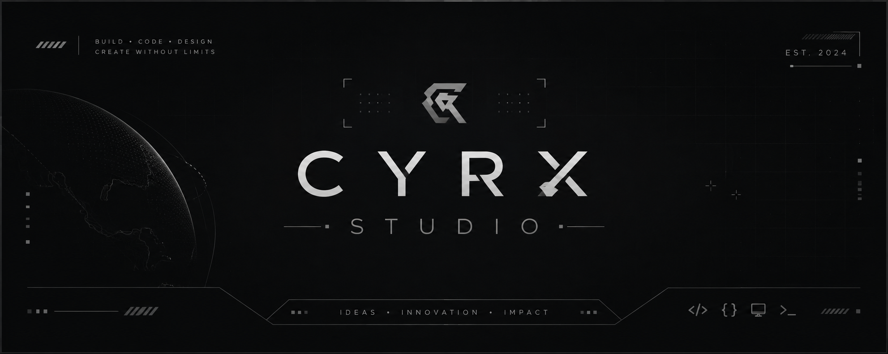

# 👋 Hi, I'm CYRX THE DEV

> BSIT Student • Aspiring Software Developer • Cybersecurity Enthusiast

  

# Overview

# BSIT Student | Aspiring Fullstack Developer & Software Developer | Cybersecurity Enthusiast | Indie Game Dev Explorer

Welcome to my GitHub! I'm an IT student on a journey to becoming a Fullstack Software Developer. Right now, I'm building interactive frontend interfaces with HTML, CSS, and Bootstrap, while constantly expanding my skillset toward fullstack technologies. Beyond web development, I have a strong interest in Cybersecurity and enjoy diving into game development during my free time. I'm always open to learning, collaborating, and working on impactful projects!

## 🛠️ Tech Stack

### Languages

  
  
  

