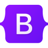

# 👋 Hi, I'm CYRX THE DEV

> BSIT Student • Aspiring Software Developer • Cybersecurity Enthusiast

  

# Overview

# BSIT Student | Aspiring Fullstack Developer & Software Developer | Cybersecurity Enthusiast | Indie Game Dev Explorer

Welcome to my GitHub! I'm an IT student on a journey to becoming a Fullstack Software Developer. Right now, I'm building interactive frontend interfaces with HTML, CSS, and Bootstrap, while constantly expanding my skillset toward fullstack technologies. Beyond web development, I have a strong interest in Cybersecurity and enjoy diving into game development during my free time. I'm always open to learning, collaborating, and working on impactful projects!

## 🛠️ Tech Stack

<table width="100%">
  <thead>
    <tr>
      <th width="33%" align="center">Languages</th>
      <th width="33%" align="center">Frameworks</th>
      <th width="34%" align="center">Tools</th>
    </tr>
  </thead>
  <tbody>
    <tr>
      <td align="center" valign="middle">
         
        
        &nbsp;&nbsp;
        
        
          
      </td>
      <td align="center" valign="middle">
         
        
          
      </td>
      <td align="center" valign="middle">
         
        
        &nbsp;&nbsp;
        
        &nbsp;&nbsp;
        
          
      </td>
    </tr>
  </tbody>
</table>
